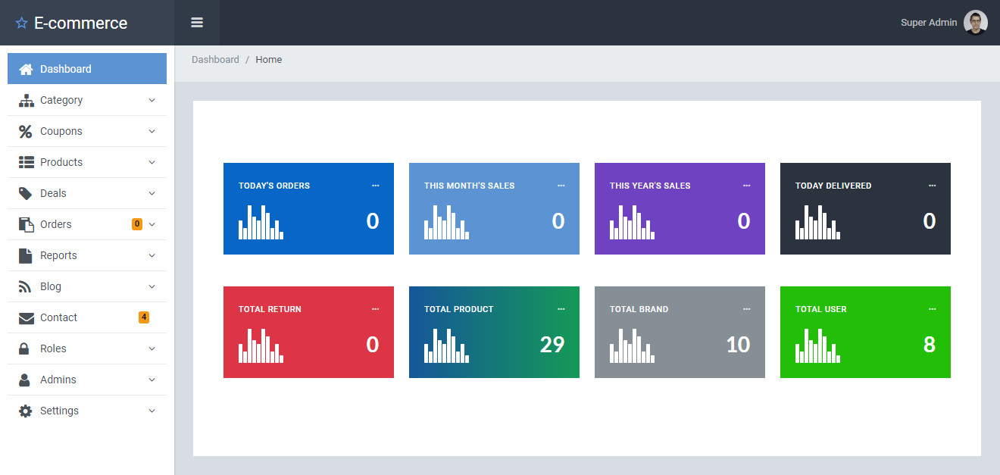
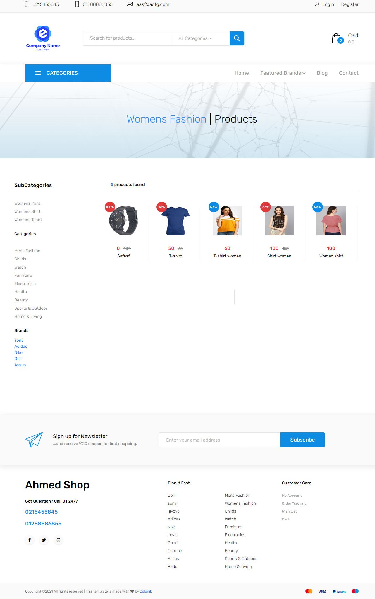
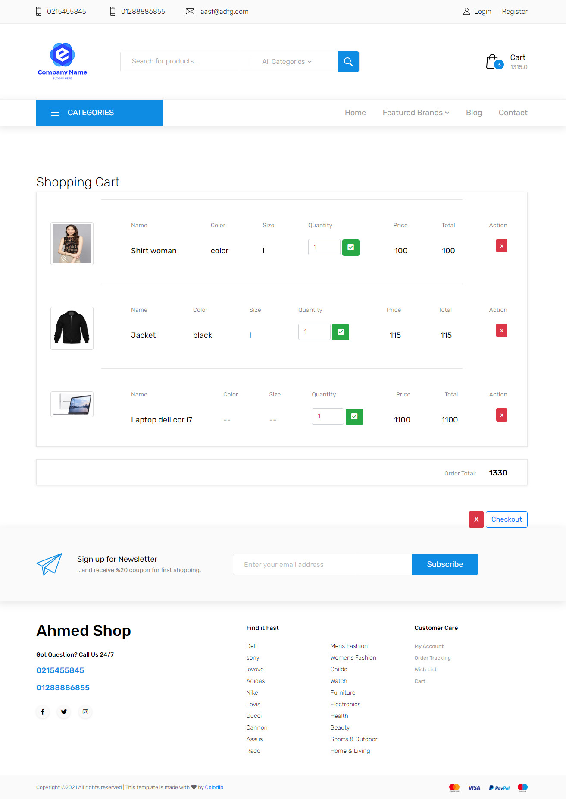
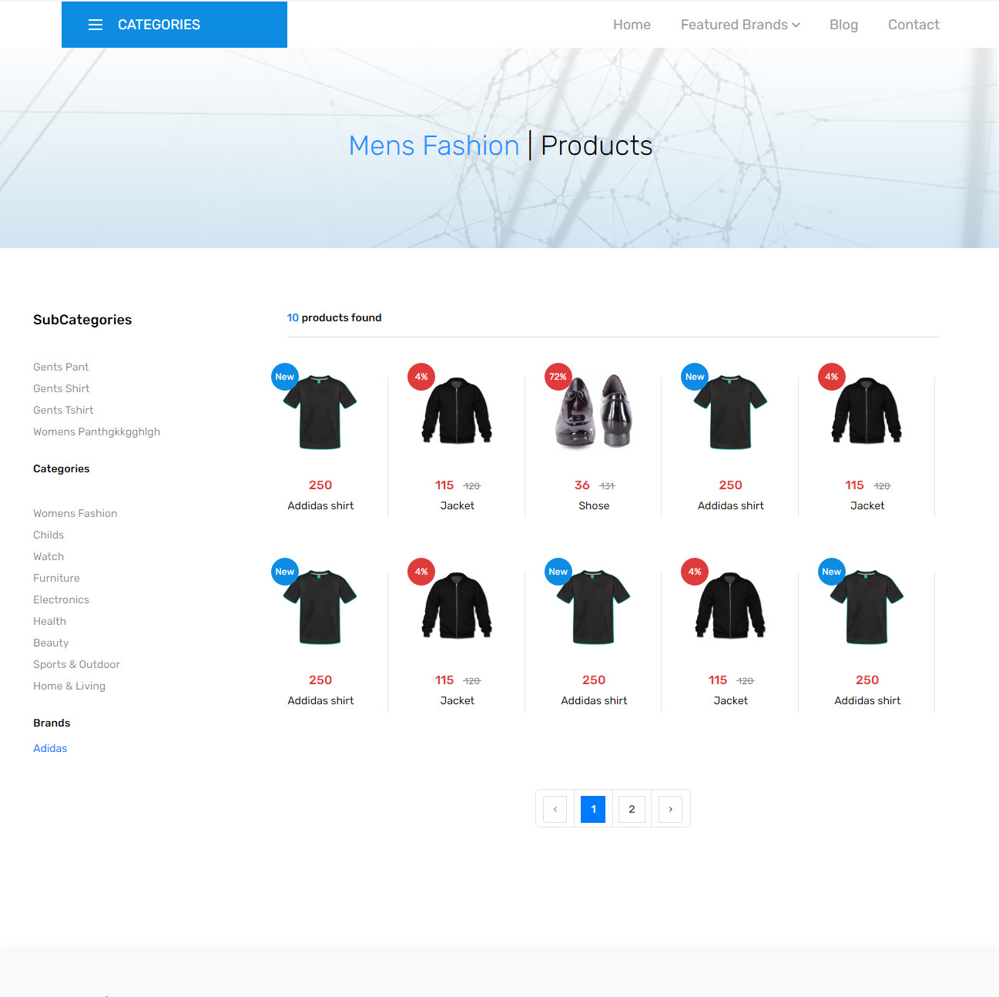
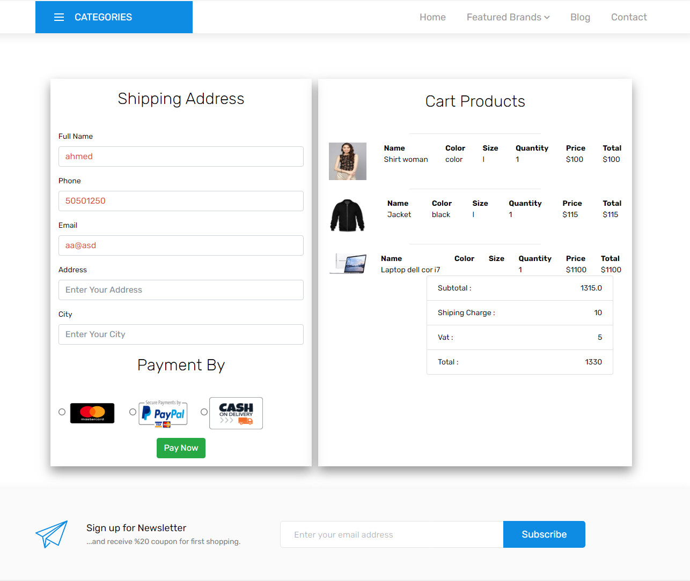
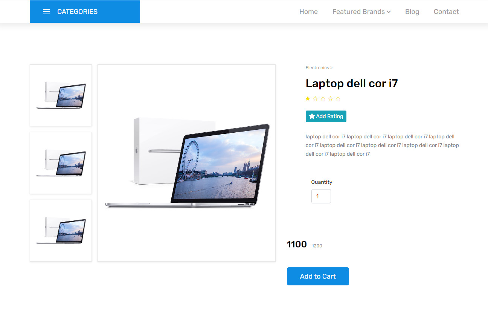

## E-commerce
### 
- A site for selling products online
- A control panel for adding and controlling products and their - classifications and subcategories, and adding offers for a period of time.
- Administrator permissions and login rules, and each of them has specific functions
- A blog for the site to be published by managers.
- Message service and communication between visitors and managers
- can log in via Facebook or Gmail
- The possibility of payment via Visa card or cash payment
- A personal customer page to view and track orders and status

## images
1 
 
#### 2 
 
#### 3 
 
#### 4 
 
#### 5 
 
#### 6 
 
